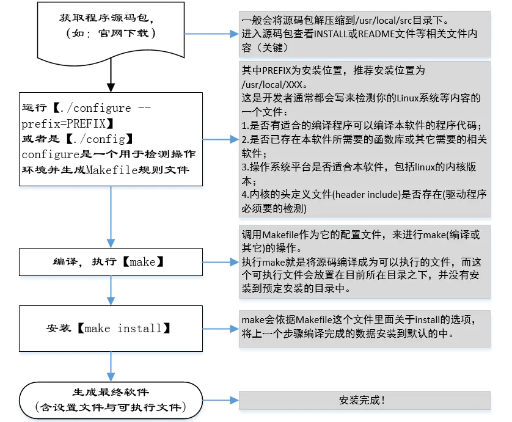

## Linux软件安装管理之——源码安装详解
一、安装包分类
在Linux平台下，软件包的类型可以划分为两类：源码包、二进制包。

源码包：即程序软件的源代码（一般也叫Tarball，即将软件的源码以tar打包后再压缩的资源包）。
二进制包：如 Red Hat发行版的.rpm包，Debian发行版的.deb包。

四、源码包安装详解
现实中，使用一个源码包来安装程序时，基本步骤如：

        在上图第二步中的--prefix后面接的路径表示这个软件将要安装到哪个目录去，如果没有指定--prefix=/path这个参数，通常默认为/usr/local。本人推荐安装位置为 /usr/local/XXX，XXX为自己的实际目录，这样会方便以后的管理。

        源码包安装方式的man文件默认保存在/usr/local/man或/usr/local/share/man中，如果你的安装路径自定义为如/usr/local/XXX，则man文件则一般是在/usr/local/XXX/share/man中。此时如果你想要通过man来查看你所安装软件的man手册，则需要自行修改man的路径配置文件（可能是man.config或者manpath.config）。需要在相应位置添加如下一行：

MANPATH    /usr/local/XXX/share/man

五、其它
1、卸载

        通过源码包安装的软件，当你想要卸载的时候，只需要把整个安装路径删除掉就行了，100%卸载，不会像windows那样经常会残留那多注册表之类的垃圾。

        根据你的安装时候选择的安装路径，源码包的卸载又仓库两种情况：

        如果你安装时候指定的路径为： --prefix=/usr/local/XXX，那么卸载的时候只需要把XXX这个文件夹删除即可，因为该软件安装的所有文件都是放置在XXX这个文件夹。

        但如果你进行源码包安装的时候没有指定位置(默认值一般为/usr/local/)，或指定的位置为--prefix=/usr/local，则这时候你安装软件生成的文件将分别存储在/usr/local/里面的bin、lib或ect等目录中，这时候卸载起来就相对麻烦一点了。

